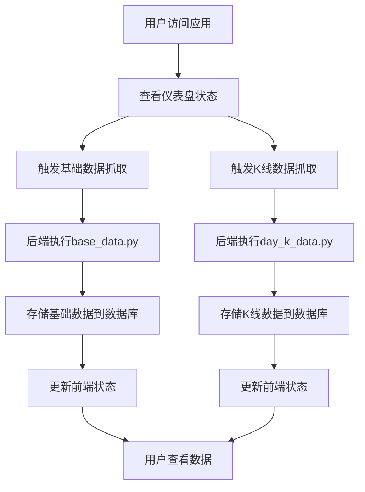

## 1. Product Overview
股票数据抓取与管理Web应用，用于自动化获取和管理A股股票和基金的基础数据及K线数据。
- 解决投资者和开发者需要手动获取和管理股票数据的问题，提供自动化的数据抓取和管理功能
- 目标用户为金融分析师、量化交易策略开发者和个人投资者

## 2. Core Features

### 2.1 User Roles
| Role | Registration Method | Core Permissions |
|------|---------------------|------------------|
| 普通用户 | 无需注册 | 查看数据抓取状态，触发数据抓取任务 |
| 管理员 | 本地配置 | 查看详细日志，配置系统参数 |

### 2.2 Feature Module
1. **仪表盘**：数据抓取状态概览，任务管理
2. **基础数据**：A股和基金基础信息管理
3. **K线数据**：股票和基金K线数据管理

### 2.3 Page Details
| Page Name | Module Name | Feature description |
|-----------|-------------|---------------------|
| 仪表盘 | 状态概览 | 显示当前数据抓取状态，包括已抓取的股票/基金数量、最近抓取时间等 |
| 仪表盘 | 任务管理 | 提供手动触发数据抓取任务的功能，包括基础数据抓取和K线数据抓取 |
| 基础数据 | 数据列表 | 显示已抓取的股票和基金基础信息，支持分页和搜索 |
| 基础数据 | 操作面板 | 提供基础数据抓取、更新和导出功能 |
| K线数据 | 数据列表 | 显示已抓取的K线数据，支持按股票/基金代码、日期范围查询 |
| K线数据 | 数据可视化 | 提供K线图表展示功能，支持基本的技术分析指标 |
| K线数据 | 操作面板 | 提供K线数据抓取、更新和导出功能 |

## 3. Core Process
用户访问应用后，可以在仪表盘查看当前数据状态，然后根据需要触发基础数据抓取或K线数据抓取任务。系统会调用后端Python脚本执行数据抓取，并将结果存储到数据库中。用户可以在相应的页面查看和管理抓取的数据。

## 4. User Interface Design
### 4.1 Design Style
- 主色调：深蓝色 (#1e40af) 和绿色 (#10b981)
- 辅助色：灰色 (#6b7280) 和白色 (#ffffff)
- 按钮风格：圆角按钮，悬停效果
- 字体：无衬线字体，主标题18px，副标题16px，正文14px
- 布局风格：卡片式布局，顶部导航栏，响应式设计
- 图标风格：线性图标，简洁现代

### 4.2 Page Design Overview
| Page Name | Module Name | UI Elements |
|-----------|-------------|-------------|
| 仪表盘 | 状态概览 | 卡片式布局，显示关键指标，使用进度条和数字展示，颜色区分不同状态 |
| 仪表盘 | 任务管理 | 大按钮设计，带有图标，悬停效果，点击后显示加载状态 |
| 基础数据 | 数据列表 | 表格布局，支持排序和搜索，分页控件，每行显示代码、名称、交易所等信息 |
| 基础数据 | 操作面板 | 按钮组，下拉选择器，进度指示器 |
| K线数据 | 数据列表 | 表格布局，支持日期范围选择，代码搜索，分页控件 |
| K线数据 | 数据可视化 | 交互式图表，支持缩放和时间范围选择，技术指标切换 |
| K线数据 | 操作面板 | 按钮组，日期选择器，代码输入框 |

### 4.3 Responsiveness
- 桌面优先设计，支持响应式布局
- 在移动设备上自动调整为单列布局
- 触摸设备优化，增大点击区域
- 图表在小屏幕上自动调整显示方式

### 4.4 3D Scene Guidance
- 不适用，本项目为数据管理应用，不需要3D场景