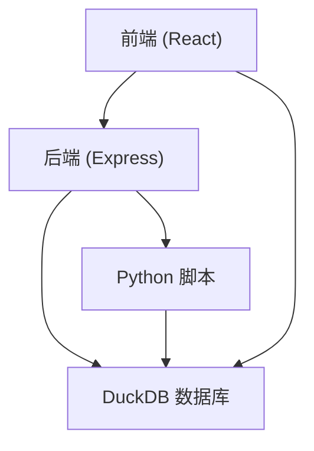
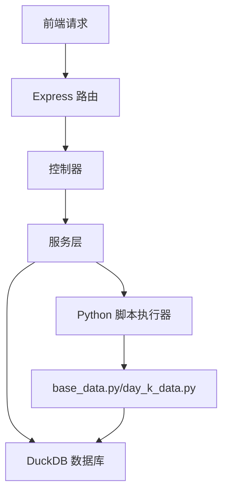
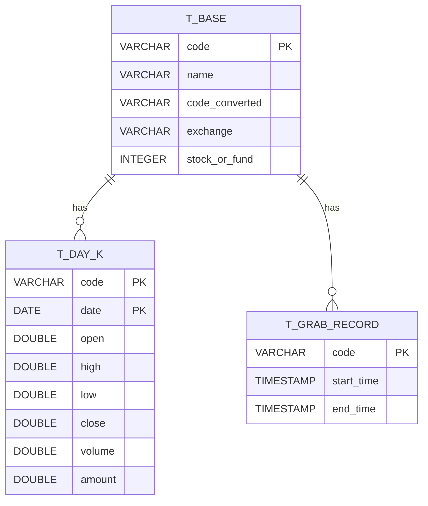

## 1. Architecture Design


## 2. Technology Description
- 前端：React@18 + TypeScript + Tailwind CSS + Vite
- 后端：Express@4 + TypeScript
- 数据库：DuckDB
- Python 脚本：base_data.py, day_k_data.py
- 初始化工具：vite-init

## 3. Route Definitions
| Route | Purpose |
|-------|---------|
| / | 仪表盘页面 |
| /base-data | 基础数据管理页面 |
| /kline-data | K线数据管理页面 |

## 4. API Definitions

### 4.1 基础数据 API

#### GET /api/base-data
- 描述：获取基础数据列表
- 参数：
  - page: 页码 (默认 1)
  - limit: 每页数量 (默认 20)
  - search: 搜索关键词
- 响应：
  ```json
  {
    "total": 1000,
    "data": [
      {
        "code": "600519",
        "name": "贵州茅台",
        "code_converted": "600519.SH",
        "exchange": "SH",
        "stock_or_fund": 1
      }
    ]
  }
  ```

#### POST /api/base-data/fetch
- 描述：触发基础数据抓取
- 参数：
  - incremental: 是否增量抓取 (默认 true)
- 响应：
  ```json
  {
    "status": "success",
    "message": "基础数据抓取任务已开始",
    "taskId": "123456"
  }
  ```

### 4.2 K线数据 API

#### GET /api/kline-data
- 描述：获取K线数据列表
- 参数：
  - code: 股票/基金代码
  - startDate: 开始日期
  - endDate: 结束日期
  - page: 页码 (默认 1)
  - limit: 每页数量 (默认 50)
- 响应：
  ```json
  {
    "total": 100,
    "data": [
      {
        "code": "600519",
        "date": "2026-04-14",
        "open": 1800.00,
        "high": 1820.00,
        "low": 1790.00,
        "close": 1810.00,
        "volume": 1000000,
        "amount": 1810000000
      }
    ]
  }
  ```

#### POST /api/kline-data/fetch
- 描述：触发K线数据抓取
- 参数：
  - code: 股票/基金代码 (可选，不提供则抓取所有)
- 响应：
  ```json
  {
    "status": "success",
    "message": "K线数据抓取任务已开始",
    "taskId": "123456"
  }
  ```

### 4.3 状态 API

#### GET /api/status
- 描述：获取系统状态
- 响应：
  ```json
  {
    "stockCount": 5491,
    "fundCount": 1438,
    "lastBaseDataFetch": "2026-04-14T10:00:00Z",
    "lastKlineDataFetch": "2026-04-14T11:00:00Z",
    "tasks": [
      {
        "id": "123456",
        "type": "base-data",
        "status": "completed",
        "startTime": "2026-04-14T10:00:00Z",
        "endTime": "2026-04-14T10:05:00Z"
      }
    ]
  }
  ```

## 5. Server Architecture Diagram


## 6. Data Model

### 6.1 Data Model Definition


### 6.2 Data Definition Language
```sql
-- 创建基础数据表
CREATE TABLE IF NOT EXISTS t_base (
    code VARCHAR,
    name VARCHAR,
    code_converted VARCHAR,
    exchange VARCHAR,
    stock_or_fund INTEGER,
    PRIMARY KEY (code)
);

-- 创建K线数据表
CREATE TABLE IF NOT EXISTS t_day_k (
    code VARCHAR,
    date DATE,
    open DOUBLE,
    high DOUBLE,
    low DOUBLE,
    close DOUBLE,
    volume DOUBLE,
    amount DOUBLE,
    PRIMARY KEY (code, date)
);

-- 创建抓取记录表
CREATE TABLE IF NOT EXISTS t_grab_record (
    code VARCHAR PRIMARY KEY,
    start_time TIMESTAMP,
    end_time TIMESTAMP
);
```